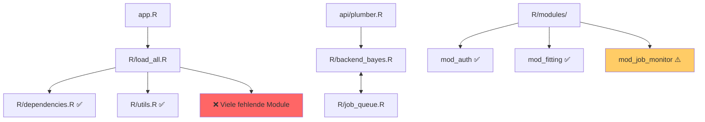

# Integrierte Projekt-Analyse Report - TDMx Repository

## 1. Übersicht
- **Projekt-Typ:** R Shiny Applikation mit Plumber API und Bayes'schen Inferenz-Backends (Stan, JAGS)
- **Anzahl Dateien:** 255
- **Hauptverzeichnisse:** `api/`, `app.R`, `R/`, `config/`, `db/`, `docs/`, `models/`, `priors/`, `report/`, `scripts/`, `tests/`, `examples/`, `audit/`
- **Projektstatus:** Fortgeschrittenes, gut dokumentiertes Projekt mit erheblichen technischen Schulden

## 2. Vollständigkeits-Check

### ✅ Vorhandene erwartete Dateien:
- `README.md` - Umfassende Projektdokumentation
- `DESCRIPTION` - R-Paket-Beschreibung mit Abhängigkeiten
- `LICENSE` - Lizenzierung vorhanden
- `app.R` - Haupt-Shiny-Applikation
- `Dockerfile.app`, `Dockerfile.api`, `docker-compose.yml` - Container-Setup
- Umfangreiche Dokumentation in `docs/` (30+ Dateien)
- Modulare Struktur in `R/` mit Dependency-Management
- Test-Suite in `tests/testthat/`
- Stan/JAGS Modelle in `models/`

### ❌ Fehlende erwartete Dateien:
- **`.gitignore`** - Kritisch für Version Control
- **`renv.lock`** - Trotz `scripts/setup.R` fehlt der Lockfile für Reproduzierbarkeit
- **`data/`** - Verzeichnis wird von Health-Checks erwartet, existiert aber nicht

### ⚠️ Verwaiste/Problematische Dateien:
- `@DANIEL-- HIER WEITER.txt` - URL-Platzhalter ohne Referenz
- `R/test-utils.R` - Testdatei außerhalb von `tests/`
- `R/modules/mod_job_monitor.R`, `mod_monitoring.R` - Nicht in app.R eingebunden
- **Duplikate:** `R/audit_fallback.R` und `R/audit-fallback.R`

## 3. Abhängigkeits-Analyse

### Kritische Pfad-Probleme:

#### 🔴 **Case-Sensitivity-Fehler (Linux/Mac-Breaking):**
- `api/plumber_auth.R` → `R/audit.r` (sollte `audit.R` sein)
- `R/fhir.R` → `fhir_connection.r` (sollte `fhir_connection.R` sein)
- Tests → `antibiogram.r` (sollte `antibiogram.R` sein)

#### 🔴 **Nicht-existente Dateien in load_all.R:**
- `utils/config`, `utils/helpers`, `utils/validators`
- `plots/plot_concentrations`, `plots/plot_parameters`
- `reports/report_generator`
- Insgesamt ~20+ fehlende Module

#### 🔴 **Zirkuläre Abhängigkeit:**
```
R/backend_bayes.R ↔ R/job_queue.R
```

### Abhängigkeits-Diagramm:


## 4. Shiny-GUI Analyse

### Funktionierende Features:
- **Navigation:** Dashboard, Data Import, Model Fitting, Diagnostics, Dose Optimization, Reports, Admin ✅
- **Authentifizierung:** `mod_auth_ui/server` mit Login/Logout-Mechanismus ✅
- **Daten-Upload:** File Input mit Example Data Loading ✅
- **Report-Generation:** PDF via rmarkdown ✅
- **Modulare Architektur:** Exzellente Struktur mit `exists()`-Checks für Graceful Degradation ✅

### Problematische Verbindungen:
- **Verwaiste Module:** `mod_job_monitor`, `mod_monitoring` ohne UI/Server-Anbindung
- **Kollidierende Implementierungen:** `run_fit_jags` in `mod_fit.R` und `R/run_fit_jags.R`
- **Fehlende Plot-Module:** Referenziert aber nicht vorhanden

## 5. Verbesserungsvorschläge

### Priorität HOCH:
1. **🔴 Case-Sensitivity-Fehler beheben**
   - Alle `.r` zu `.R` umbenennen
   - Pfadangaben in source() und library() korrigieren
   - **Impact:** App läuft sonst nicht auf Linux/Mac

2. **🔴 load_all.R bereinigen**
   - Nicht-existente Module entfernen oder als Stubs erstellen
   - **Impact:** App startet nicht ohne Fix

3. **🔴 Zirkuläre Abhängigkeit auflösen**
   - backend_bayes.R ↔ job_queue.R entkoppeln
   - **Impact:** Potentielle Stack Overflows

4. **🔴 Sicherheit: Klartext-Passwörter**
   - `config/users.yaml` mit `R/auth_safe_upgrade.R` hashen
   - **Impact:** Sicherheitsrisiko

### Priorität MITTEL:
1. **Repository-Hygiene**
   - `.gitignore` hinzufügen
   - `renv.lock` generieren mit `renv::snapshot()`
   - Duplikate und verwaiste Dateien entfernen

2. **Package Management modernisieren**
   - `library()` aus Modulen entfernen
   - Durchgängig `::` Notation verwenden
   - DESCRIPTION aktualisieren

3. **Health-Checks anpassen**
   - `data/` Verzeichnis optional machen

### Priorität NIEDRIG:
1. **Code-Konsistenz**
   - Einheitliche Dateinamen-Konvention
   - Code-Styling mit `styler`
   
2. **Performance-Optimierung**
   - Async-Processing weiter ausbauen
   - Cache-Strategien implementieren

3. **Dokumentation**
   - Roxygen2-Kommentare hinzufügen
   - API-Dokumentation vervollständigen

## 6. Empfohlene nächste Schritte:

### Sofort (Day 1):
```bash
# 1. Case-Sensitivity fixen
find R -name "*.r" -exec rename 's/\.r$/.R/' {} \;

# 2. Load-Pfade bereinigen
grep -r "source\|library" R/ | grep "\.r\"" 

# 3. Gitignore hinzufügen
echo -e ".Rproj.user\n.Rhistory\n.RData\n*.Rproj\nrenv/library/" > .gitignore
```

### Kurzfristig (Week 1):
1. **Test-Suite ausführen** nach Fixes
2. **renv::snapshot()** für Lockfile
3. **Passwörter hashen** mit auth_safe_upgrade
4. **Verwaiste Module** evaluieren und integrieren/entfernen

### Mittelfristig (Month 1):
1. **Refactoring** der zirkulären Abhängigkeiten
2. **CI/CD Pipeline** aufsetzen
3. **Performance-Tests** durchführen
4. **Security-Audit** komplett

## 📊 Gesamtbewertung:

**Positiv:**
- ✅ Professionelle Projektstruktur mit 255 Dateien
- ✅ Umfassende Dokumentation (30+ docs)
- ✅ Modulare Architektur mit Best Practices
- ✅ Docker-Setup vorhanden
- ✅ Test-Suite implementiert
- ✅ Robuste Fehlerbehandlung

**Kritisch:**
- ❌ **Wird auf Linux/Mac ohne Fixes nicht laufen**
- ❌ Erhebliche technische Schulden in der Implementierung
- ❌ Sicherheitsrisiken (Klartext-Passwörter)
- ❌ Fehlende Reproduzierbarkeit (kein Lockfile)

## Fazit:
Ein **ambitioniertes, gut konzipiertes Projekt** mit solider Architektur, das jedoch vor dem produktiven Einsatz **dringend technisches Cleanup** benötigt. Die kritischen Issues sind alle lösbar, erfordern aber systematische Nacharbeit. Mit 1-2 Wochen fokussierter Arbeit kann das Projekt produktionsreif gemacht werden.